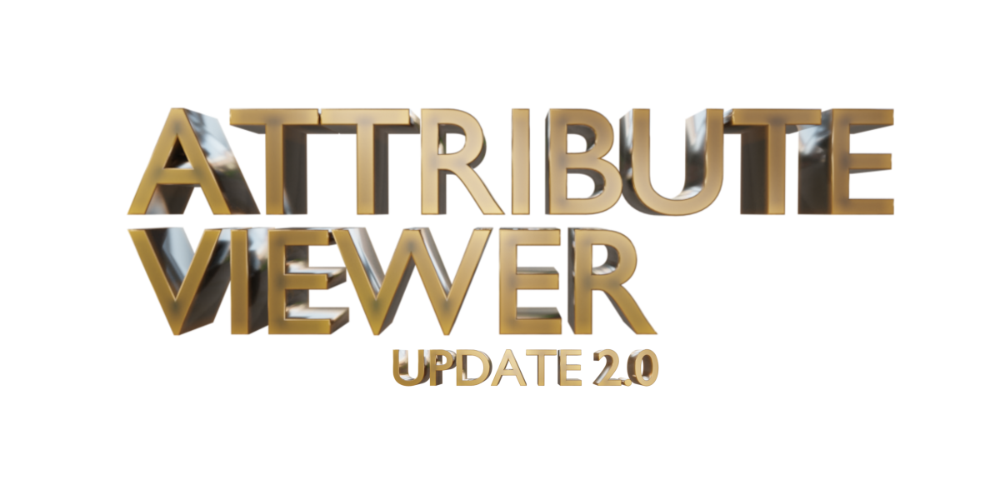
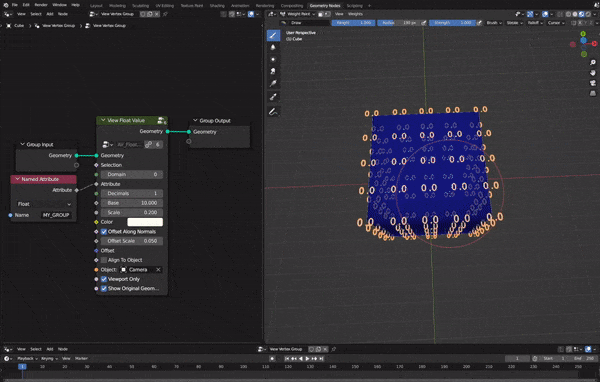
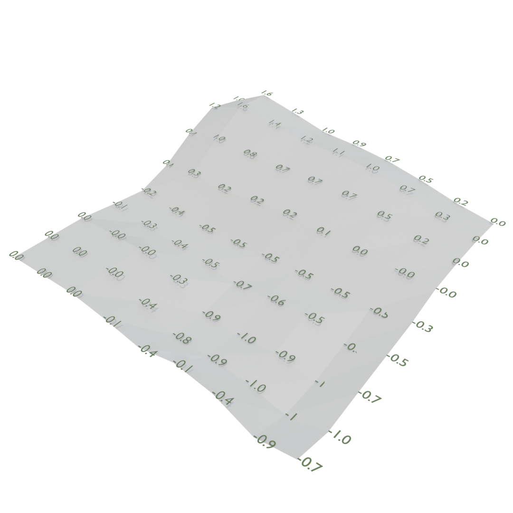
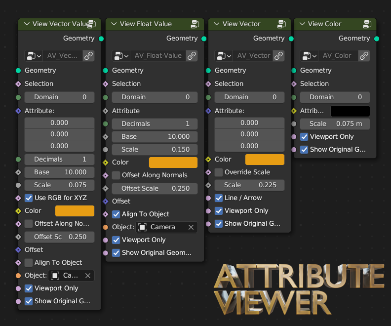

    
    

<h3 align="center">
    Geometry Nodes Attribute Viewer
</h3>

    Make your geometry nodes workflow easier with viewer nodes!

    <a href="https://blendermarket.com/products/geometry-nodes-attribute-viewer">Blender Market</a> |
    <a href="https://griperis.gumroad.com/l/attribute-viewer">Gumroad</a> |
    <a href="https://www.buymeacoffee.com/griperis">Buy me a coffee</a>

## Quickstart
You can install the Attribute Viewer as an **addon** or use the viewer nodes through the native **asset browser**. Attribute viewer supports Blender of versions 3.4 and higher.

For **addon installation** download and use the `attribute_viewer_2.0.0.zip` file and install it in Blender (Edit -> Preferences -> Addons) as described in [official documentation](https://docs.blender.org/manual/en/latest/editors/preferences/addons.html#installing-add-ons). Afterwards a new node category `View` will appear and you can spawn nodes from there or check *Introduction/Controls* for more information.

For **asset browser** installation download and use the `av_2.0_asset-lib.blend` and put it in your libraries folder, then make sure that the path is in your asset libraries (Preferences -> File Paths -> Asset Libraries). Afterwards the viewer nodes should appear in the asset browser.

## Introduction
> Did you ever lack the possibility to see the spreadsheet right in the 3D view?
 
> Did you wonder what the concrete values of vertex group are? 

> What's the randomly generated color that you are plugging into other node? 

This is all possible now by plugging one of nodes of Attribute Viewer to your node tree. We visualize the values by generating customizable text numbers at the place of your attributes. The generated text can also be used in your renders, not only for debugging.

### Nodes
Attribute Viewer comes with four main node groups that can be used in your node tree. The nodes have almost similar interfaces with a few specifics. 

- **View Float Value** can be used to view `bool`, `float`, or `integer` values.
- **View Vector Value** supports vector and color. Shows all the components of the number.
- **View Vector** displays a arrow or a line in the direction of the input vector.
- **View Color** spawns points of desired color on desired domain. Use this to visualize the positions or color values of certain attributes.

#### Common Inputs
- **Geometry** - Attribute on this geometry will be considered.
- **Selection** - Boolean flagging whether to consider this point on its domain.
- **Domain** - From where to read the attribute and where it should be visualized. Supported domains:
    - `0` - Vertex / Spline point / Point Cloud point
    - `1` - Edge
    - `2` - Face
    - `3` - Face Corner
    - `4` - Instance
    - `5` - Spline 
- **Attribute** - The attribute to visualize - can be a single value or a field.
- **Color** - `AV_Material` is automatically assigned to all generated text values, you can use this to change the viewer color in rendered view.
- **Scale** - Multiplier of the viewer scale.
- **Viewport Only** - If clicked in then the generated viewer text is only shown in viewport. If toggled off the text is shown also in render.
- **Show Original Geometry** - Whether to propagate the original geometry. You can turn this off if you also join the original geometry to the result elsewhere. 

#### Value Viewer Inputs
- **Decimals** - How many decimal places will be displayed.
- **Base** - Base for calculation of the viewed numbers. You can use this to convert between different number systems (really necessary feature 😂).
- **Offset Along Normals** - On / Off - toggle to offset with `Offset Scale` in the direction of normal vector.
- **Offset Scale** 
- **Align To Object** - Toggle this to align to the object selected in `Object`.
- **Object** - This object position is going to be used when `Align To Object` is set to True.

### Addon Controls
If you decided to use the addon version, you are able to use *Node Wrangler*-like controls to view your attributes.   
- `CTRL+SHIFT+Middle Mouse` (on a node with attributes) - cycle through attributes and view them (or connect geometry to the active viewer)
- `CTRL+SHIFT+Right Click` (on a node connected to viewer) - remove connected viewers from active node
- `CTRL+SHIFT+W` - show addon menu, you can add viewers or remove all viewers from here

<!-- TODO: Rebind controls -->
### What people say

> Immensely useful addon. Makes debugging node trees much much easier.

> Really useful, making geo-nodes much more visualizable. Helps me a lot with my current project!

> ...
## Release Log

- **2.0.0** *(10. 7. 2022)* - updated attribute-number-text generator, attribute **domain support**, label **alignment**, **selection** input, simplified node setups
- **1.0.1** *(25. 11. 2022)*  - fixed error when other join geometry node was present
- **1.0.0** *(18. 11. 2022)* - initial release supporting attribute viewing, number display node and addon code

## License
Addon is licensed under GNU GPL 3.0.